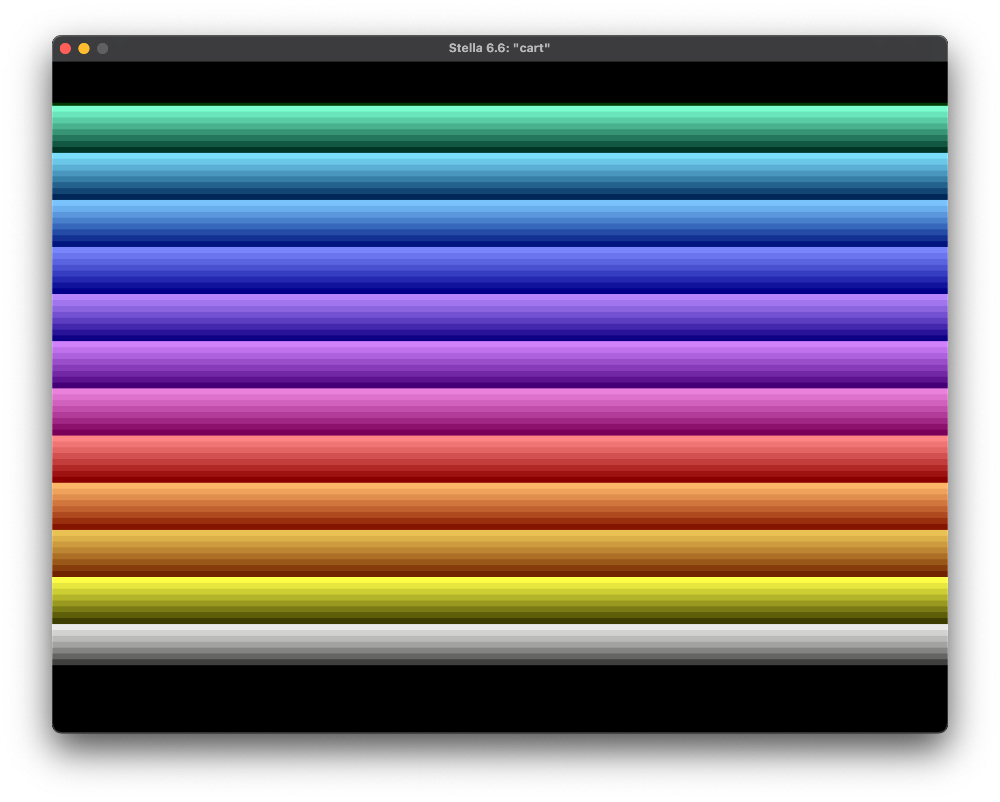
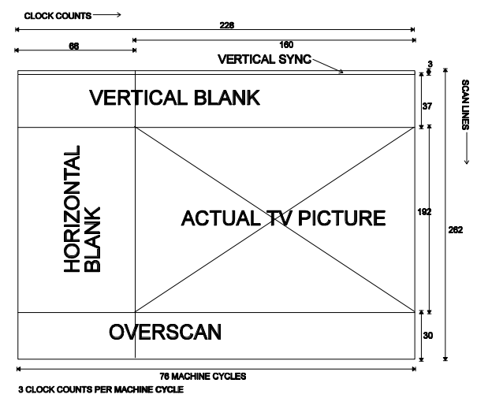

# [**_Nijigasaki_: Rainbow Background Screen**](nijigasaki.asm)



## Description

Finally putting pixels (or [**scan lines**](https://en.wikipedia.org/wiki/Scan_line), in this case) on the screen! Following Atari VCS's NTSC scan line model, this simple cart will put a cute [**rainbow**](https://static.wikia.nocookie.net/love-live/images/d/d6/Nijigasaki_Season_2_visual.jpg/revision/latest/scale-to-width-down/771?cb=20211003114331) on the screen.



<sub>**Figure 1**: The Atari VCS/2600's Scan Line Model.</sub>

## Code Segments

### Start a new frame by turning on the vertical sync (`VSYNC`) and the vertical blank (`VBLANK`)


```asm
NextFrame:
    LDA #2
    STA VBLANK                  ; turn on VBLANK
    STA VSYNC                   ; turn on VSYNC
```

### Generate the 3 lines of `VSYNC`

```asm
    STA WSYNC                   ; first scanline
    STA WSYNC                   ; second scanline
    STA WSYNC                   ; third scanline

    LDA #0
    STA VSYNC                   ; turn off VSYNC
```

### Let the TIA output the 37 recommended lines of `VBLANK`

```asm
    LDX #37                     ; x = 37; counter for our loop

LoopVBlank:
    STA WSYNC                   ; hit WSYNC and wait for the next scanline
    DEX                         ; x--
    BNE LoopVBlank              ; loop while x != 0

    LDA #0
    STA VBLANK                  ; turn off VBLANK
```

### Draw 192 scan lines

For this, we start with the literal decimal value `192` (`C0` in hex), which corresponds to a green colour in the Atari 2600's [**colour palette**](https://en.wikipedia.org/wiki/List_of_video_game_console_palettes#NTSC). We then store that value in the background color luminance memory address (`COLUBK`), and loop down to 0. This creates a rainbow effect.

```asm
    LDX #192                    ; x = 192; counter for loop

LoopVisible:
    STX COLUBK                  ; set the background colour
    STA WSYNC                   ; wait for next scanline
    DEX                         ; x--
    BNE LoopVisible             ; loop while x != 0
```

### Output 30 more `VBLANK` lines ("overscan") to complete our frame

```asm
    LDA #2
    STA VBLANK                  ; hit VBLANK again

    LDX #30                     ; x = 30
LoopOverscan:
    STA WSYNC                   ; wait for next scanline
    DEX                         ; x--
    BNE LoopOverscan            ; loop while x != 0

    JMP NextFrame               ; start next frame
```